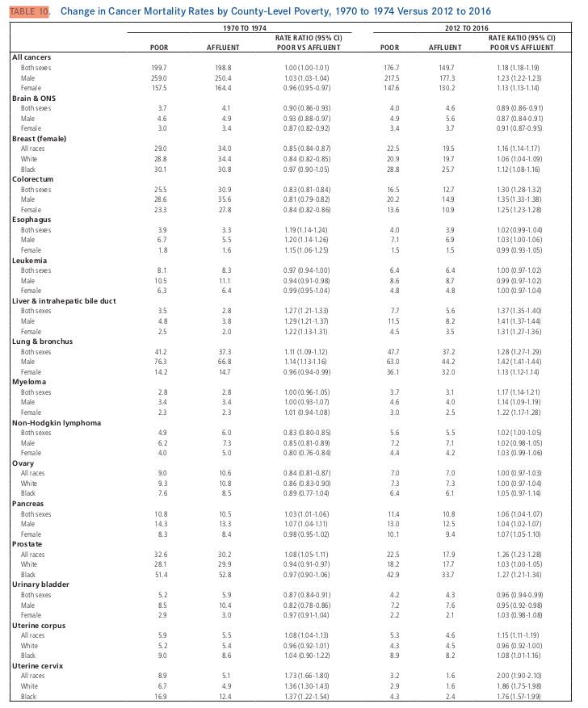

```{R opts, warning = FALSE}

# Set global options
knitr::opts_chunk$set(echo = TRUE
   , warning = FALSE
   , message = FALSE
   , fig.width = 12
   , fig.height = 10
   , results = "asis")
options(width = 12)

## Install or load required packages

library(tabulizer, warn.conflicts = FALSE)

library(data.table, warn.conflicts = FALSE)
library(DT, warn.conflicts = FALSE)

library(tibble, warn.conflicts = FALSE)
library(tidyr, warn.conflicts = FALSE)
library(dplyr, warn.conflicts = FALSE)

library(ggplot2, warn.conflicts = FALSE)
library(gridExtra, warn.conflicts = FALSE)
theme_set(theme_bw() + 
	theme(panel.spacing=grid::unit(0,"lines"))) 
```
## Question 

**Explain what features of the data you are trying to draw attention to, and what story you think your figures tell (or fail to tell).**

- The explorations are based on Table 10 of [Siegel et. al](https://onlinelibrary.wiley.com/doi/pdfdirect/10.3322/caac.21551). The Tables shows the change in Cancer Mortality Rates by Count-Level Poverty, 1970 to 1974 Versus 2012 to 2016.

> - Provided clear trends in the Mortality rates across the two year bands and a one-to-one comparison between the cancer types. 
> - In addition, from the Table, the cancer types are sex and race specific. Hence, I provided distinctive graphs for Sex and Race.
>- Plot two categeories of graphs: 

> > - **Mortality rate graphs**: Rates are per 100,000 population and age adjusted to the 2000 US standard population. The first set of Figures show the estimatesin Mortality rates among the poor and the affluent for all the cancer types.
> > - **Rate ratio**: unrounded rate in poor counties divided by the corresponding unrounded rate in affluent counties: These are shown in second set of plots. The confidence interval bands are also added around the estimates.

## The table extracted from [Siegel et. al](https://onlinelibrary.wiley.com/doi/pdfdirect/+ 10.3322/caac.21551).



## Downloading data and some checks

The script below will, if data doesn't exist in the local directory, automatically download the data and load it, otherwise load it.

```{R download_df}

## ---- Create Output folder ----

dirs <- list.dirs(".")
dirname <- "HW3"
if (length(dirs)>1 & sum(grepl(dirname, dirs, ignore.cas = TRUE))==0){
	dir.create(paste0("./", dirname))
}

#### ---- Downloading the pdf file and extract the data ----

## Check if the paper exisits otherwise download and extract the table on pdf page 19
paper_url <- "https://onlinelibrary.wiley.com/doi/pdfdirect/10.3322/caac.21551"
paper_name <- "siegel2019.pdf"
dataset_name <- "siegel2019_data.csv"

if(length(list.files("."))>0 & sum(grepl(dataset_name, list.files("."), ignore.case = TRUE))==1){
	df_name <- grep(dataset_name, list.files(), value = TRUE)
	print("Reading dataset from your computer... \n")
	working_df <- read.csv(df_name)
	downloaded = FALSE # Checked to make sure we only do cleaning once
	cat(df_name, " dataset already saved!!! We'll proceed to analysis.", "\n")
} else {
	# Download paper and extract table 19
	cat("Downloading paper from ", paper_url, " and then extracting table 19", "\n")
	download.file(paper_url, paper_name, quiet = TRUE)
	siegel2019_df <- extract_tables(paper_name, pages = 19, output = "data.frame")[[1]]
	working_df <- siegel2019_df
	downloaded = TRUE 
	cat(dataset_name
		, " didn't exist!!! We've downloaded data from the url "
		, paper_url, "\n Dataset dim: "
		, dim(siegel2019_df)
	)
}
```

### Data cleaning and formatting

Define some useful functions

```{R useful_functions}
# Count the number of a given character for the combined column (temp_values)
countFunc <- function(variable, cpattern){
	nspaces <- sapply(regmatches(variable, gregexpr(cpattern, variable)), length)
	return(nspaces + 1)
}

# Separate the combined values into different cells
separateFunc <- function(df, variable, spattern, cpattern){
	df <- (df
		%>% setnames(variable, "temp_sep", skip = TRUE)
		%>% mutate(nspaces = countFunc(temp_sep, cpattern))
	)
	nspacesmax <- max(pull(df, nspaces), rm.na = TRUE)
	df <- (df
		%>% select(-nspaces)
		%>% separate(temp_sep
			, into = paste0(variable, "_", 1:nspacesmax)
			, sep = spattern
			, remove = TRUE
			, convert = TRUE
		)
		%>% setnames("temp_sep", variable, skip = TRUE)
	)
}

```

```{R formart_data}
if (downloaded){
	working_df <- (working_df
		%>% setnames(names(.), c("temp_labels", "temp_values"))
		%>% filter(grepl("[A-z]", temp_labels) & !grepl("TABLE", temp_labels))
		%>% mutate(cancer_types = ifelse(temp_values == "", as.character(temp_labels), NA))
		%>% fill(cancer_types)
		%>% filter(temp_values != "")
		%>% separateFunc(., "temp_values", spattern = " ", cpattern = "")
		%>% separateFunc(., "temp_values_4", spattern = "-", cpattern = "-")
		%>% separateFunc(., "temp_values_8", spattern = "-", cpattern = "-")
		%>% select_if(~sum(!is.na(.)) > 0)
		%>% mutate_at(grep("_[0-9]_[0-9]$", names(.), value = TRUE)
			, function(x) as.numeric(gsub("\\(|\\)", "", x))
		)
		# Add the names in the pdf
		%>% setnames(grep("^temp_", names(.), value = TRUE)
			, c("categories"
				, paste0(c("Poor", "Affluent", "Rate_Ratio", "lower", "upper"), ".1970_1974")
				, paste0(c("Poor", "Affluent", "Rate_Ratio", "lower", "upper"), ".2012_2016")
			)
		)
	)
	write.csv(working_df, dataset_name, row.names = FALSE)
}
````

Restructure the dataset to long format to extract years and for plotting

```{R data_restructure}
working_df <- (working_df
	%>% gather(labels, values, -c("categories", "cancer_types"))
	%>% separate(labels, into = c("labels", "years"), sep = "\\.")
	%>% mutate_at("years", function(x)gsub("_", "-", x))
	%>% mutate(grp_cat = ifelse(grepl("races|Black|White", categories), "Race", "Sex"))
)

# Temporary data to plot Mortality rates
temp_df1 <- (working_df
	%>% mutate(categories = reorder(categories, values, FUN = function(x) -x[1]))
	%>% mutate(cancer_types = reorder(cancer_types, values, FUN = function(x) -x[1]))
)

# Temporary data for CI ploting
temp_df <- (working_df
	%>% filter(grepl("lowe|upp|Rate", labels))
	%>% spread(labels, values)
	%>% mutate(cancer_types = reorder(cancer_types, Rate_Ratio, FUN = function(x) -x[1]))
)

```


## Mortality rate plots

### Sex plot

```{R plot_poor_affluent_sex}
plot_poor_affluent_sex <- (ggplot(temp_df1
	%>% filter(labels %in% c("Affluent", "Poor") & grepl("Sex", grp_cat, ignore.case = TRUE))
		, aes(x=years, y=values, fill = categories))
	+ geom_bar(stat = "identity", position = position_dodge(width = 0.7))
	+ scale_colour_brewer(palette="Dark2")
	+ scale_fill_brewer(palette="Dark2")
	+ facet_wrap(cancer_types ~ labels, ncol = 4)
	+ labs(x = "Years"
			, y = "Cancer mortality rates per 100,000 population"
			, title = "Sex"
			, fill = "Sex"
		)
	+ theme(legend.position="bottom"
		, plot.title = element_text(hjust = 0.5)
	)
)
```

### Race plot

```{R plot_poor_affluent_race}
plot_poor_affluent_Race <- (ggplot(temp_df1
	%>% filter(labels %in% c("Affluent", "Poor") & grepl("Race", grp_cat, ignore.case = TRUE))
		, aes(x=years, y=values, fill = categories))
	+ geom_bar(stat = "identity", position = position_dodge(width = 0.7))
	+ scale_colour_brewer(palette="Dark2")
	+ scale_fill_brewer(palette="Dark2")
	+ facet_wrap(cancer_types ~ labels, ncol = 4)
	+ labs(x = "Years"
			, y = "    "
			, title = "Race"
			, fill = "Race"
		)
	+ theme(legend.position="bottom"
		, plot.title = element_text(hjust = 0.5)
	)
)
```

### Mortality rate plots showing the estimates for sex and race specific cancer types.

```{R, echo = FALSE}
grid.arrange(plot_poor_affluent_sex, plot_poor_affluent_Race, ncol=2)
```

## Rate ratio plots

### Sex plot

```{R plot_sex}
plot_sex <- (ggplot(temp_df
	%>% filter(grepl("Sex", grp_cat, ignore.case = TRUE))
		, aes(x=years, y=Rate_Ratio, colour = categories)) 
	+ geom_point()
	+ geom_ribbon(aes(ymin=lower, ymax=upper, group = categories, fill = categories), color = NA, alpha = 0.3)
	+ facet_wrap(~cancer_types, ncol = 2)
	+ scale_colour_brewer(palette="Dark2")
	+ scale_fill_brewer(palette="Dark2")
	+ labs(x = "Years"
			, y = "Rate ratio of poor vs affluent counties (and 95% CI)"
			, title = "Sex"
			, fill = "Sex"
			, colour = "Sex"
		)
	+ theme(legend.position="bottom"
		, plot.title = element_text(hjust = 0.5)
	)
)
```

### Race plot

```{R plot_race}
plot_race <- (ggplot(temp_df
	%>% filter(grepl("Race", grp_cat, ignore.case = TRUE))
		, aes(x=years, y=Rate_Ratio, colour = categories)) 
	+ geom_point()
	+ geom_ribbon(aes(ymin=lower, ymax=upper, group = categories, fill = categories), color = NA, alpha = 0.3)
	+ facet_wrap(~cancer_types, ncol = 2)
	+ scale_colour_brewer(palette="Dark2")
	+ scale_fill_brewer(palette="Dark2")
	+ labs(x = "Years"
			, y = "   "
			, title = "Race"
			, fill = "Race"
			, colour = "Race"
		)
	+ theme(legend.position="bottom"
		, plot.title = element_text(hjust = 0.5)
	)
)
```

### Rate ratio plots showing the ratio estimates together with confidence intervals for sex and race specific cancer types.

```{R, echo = FALSE}
grid.arrange(plot_sex, plot_race, ncol=2)
```
